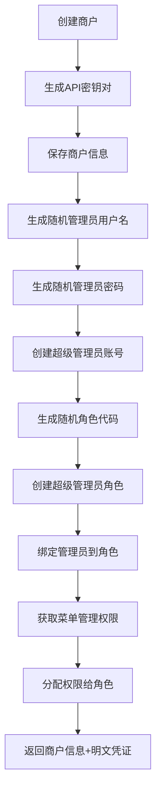

# 商户自动创建管理员功能说明

## 功能概述

当创建新商户时，系统会自动为该商户创建一套完整的管理体系，包括：

1. **超级管理员账号**：随机生成的用户名和密码
2. **超级管理员角色**：拥有菜单管理权限
3. **自动权限分配**：角色自动关联菜单管理相关权限
4. **数据隔离**：所有数据通过 `merchant_id` 关联到商户

## 实现细节

### 1. 创建商户时的自动操作流程



### 2. 随机凭证生成规则

#### 管理员用户名
- 格式：`admin_` + 8位随机字符（小写字母+数字）
- 示例：`admin_ic0qxa2b`
- 唯一性：自动检查数据库中是否存在，重复则重新生成

#### 管理员密码
- 长度：12位
- 组成：大小写字母 + 数字 + 特殊字符 (!@#$%^&*)
- 强度：确保至少包含每种类型的字符
- 示例：`GYO^ozajRlV8`
- 存储：数据库存储bcrypt加密后的密码，API返回明文（仅创建时）

#### 角色代码
- 格式：`SUPER_ADMIN_` + 8位随机字符（大写字母+数字）
- 示例：`SUPER_ADMIN_1DAQMQSI`
- 唯一性：自动检查数据库中是否存在，重复则重新生成

### 3. 数据库结构

#### admins 表
```sql
CREATE TABLE `admins` (
  `id` BIGINT PRIMARY KEY AUTO_INCREMENT,
  `merchant_id` BIGINT DEFAULT 1 COMMENT '所属商户ID',
  `username` VARCHAR(50) UNIQUE COMMENT '用户名',
  `password` VARCHAR(255) COMMENT '密码（bcrypt加密）',
  `real_name` VARCHAR(50) COMMENT '真实姓名',
  `email` VARCHAR(100) UNIQUE COMMENT '邮箱',
  `status` TINYINT DEFAULT 1 COMMENT '状态',
  ...
);
```

#### roles 表
```sql
CREATE TABLE `roles` (
  `id` BIGINT PRIMARY KEY AUTO_INCREMENT,
  `merchant_id` BIGINT DEFAULT 1 COMMENT '所属商户ID',
  `name` VARCHAR(50) COMMENT '角色名称',
  `code` VARCHAR(50) UNIQUE COMMENT '角色代码',
  `status` TINYINT DEFAULT 1 COMMENT '状态',
  ...
);
```

#### admin_roles 表（中间表）
```sql
CREATE TABLE `admin_roles` (
  `id` BIGINT PRIMARY KEY AUTO_INCREMENT,
  `admin_id` BIGINT COMMENT '管理员ID',
  `role_id` BIGINT COMMENT '角色ID',
  `created_at` TIMESTAMP DEFAULT CURRENT_TIMESTAMP,
  FOREIGN KEY (`admin_id`) REFERENCES `admins`(`id`),
  FOREIGN KEY (`role_id`) REFERENCES `roles`(`id`)
);
```

#### role_permissions 表（中间表）
```sql
CREATE TABLE `role_permissions` (
  `role_id` BIGINT COMMENT '角色ID',
  `permission_id` BIGINT COMMENT '权限ID',
  PRIMARY KEY (`role_id`, `permission_id`),
  FOREIGN KEY (`role_id`) REFERENCES `roles`(`id`),
  FOREIGN KEY (`permission_id`) REFERENCES `permissions`(`id`)
);
```

### 4. 权限分配

自动为超级管理员角色分配以下权限：

```sql
-- 查询条件
WHERE code LIKE 'menu:%' OR code LIKE 'system:menu:%'
```

当前分配的权限包括：
- 菜单管理相关的所有权限
- 系统菜单权限

### 5. API 响应格式

#### 创建商户成功响应

```json
{
  "code": 200,
  "data": {
    "id": 3,
    "merchantCode": "SHOP_1760069371",
    "merchantName": "示例电商平台",
    "merchantType": 2,
    "apiKey": "mk_4b533fe4dcc7449e82468dce71ea05c4...",
    "apiSecret": "2cdeae744c2a38571dbfbe81d4d903571561...",
    // ... 其他商户字段

    "superAdmin": {
      "username": "admin_kxakmak6",
      "password": "twuKNw@a4&*Q",
      "email": "admin_kxakmak6@shop_1760069371.com"
    }
  },
  "msg": "创建成功"
}
```

## 使用示例

### 1. 创建商户

```bash
curl -X POST "http://localhost:3000/api/merchants" \
  -H "Authorization: Bearer YOUR_TOKEN" \
  -H "Content-Type: application/json" \
  -d '{
    "merchantCode": "SHOP_001",
    "merchantName": "示例商店",
    "merchantType": 2,
    "contactName": "张三",
    "contactPhone": "13800138000",
    "maxProducts": 1000
  }'
```

### 2. 响应中获取管理员凭证

```json
{
  "code": 200,
  "data": {
    "id": 5,
    "merchantCode": "SHOP_001",
    "superAdmin": {
      "username": "admin_abc12345",
      "password": "P@ssw0rd!xyz",
      "email": "admin_abc12345@shop_001.com"
    }
  }
}
```

### 3. 使用新管理员登录

```bash
curl -X POST "http://localhost:3000/api/auth/login" \
  -H "Content-Type: application/json" \
  -d '{
    "username": "admin_abc12345",
    "password": "P@ssw0rd!xyz",
    "captchaId": "...",
    "captcha": "..."
  }'
```

## 安全性说明

### 密码安全
- ✅ 数据库存储bcrypt加密的密码（rounds=10）
- ✅ 明文密码仅在创建时通过API返回一次
- ✅ 密码长度12位，包含大小写字母、数字、特殊字符
- ✅ 密码随机生成，无规律可循

### 用户名安全
- ✅ 随机生成，不包含敏感信息
- ✅ 唯一性校验，避免冲突
- ✅ 格式统一，便于识别

### 数据隔离
- ✅ 每个商户的管理员、角色、权限都通过 `merchant_id` 隔离
- ✅ 超级管理员只能管理自己商户的数据
- ✅ 平台管理员（merchant_id=1）可以管理所有商户

## 测试验证

完整的测试脚本位于：`/test-complete-merchant-flow.sh`

运行测试：
```bash
bash /Users/mac/test/cursor1/cursor_shop/test-complete-merchant-flow.sh
```

测试内容包括：
1. ✅ 平台管理员创建商户
2. ✅ 验证超级管理员账号已创建
3. ✅ 验证角色已创建
4. ✅ 验证管理员-角色绑定
5. ✅ 验证权限已分配
6. ✅ 验证数据正确关联到商户
7. ✅ 验证新管理员可以登录

## 注意事项

1. **密码保存**：创建商户时返回的明文密码请务必保存，后续无法再次获取
2. **唯一性**：用户名、角色代码都会自动检查唯一性，无需担心冲突
3. **权限扩展**：如需为超级管理员分配更多权限，可修改 `MerchantsService.create()` 中的权限查询条件
4. **邮箱格式**：自动生成的邮箱格式为 `{username}@{merchantCode}.com`（小写）
5. **数据一致性**：创建过程中如发生错误，建议清理相关数据后重试

## 相关文件

- `/backend/src/modules/merchants/merchants.service.ts` - 核心业务逻辑
- `/backend/src/modules/merchants/merchants.controller.ts` - API端点
- `/backend/src/modules/merchants/merchants.module.ts` - 模块定义
- `/backend/src/database/entities/admin.entity.ts` - 管理员实体
- `/backend/src/database/entities/role.entity.ts` - 角色实体
- `/database/商户管理接口文档.md` - 完整API文档

## 更新日志

- **2025-10-10**: 实现商户自动创建管理员功能
  - 自动生成随机用户名和密码
  - 自动创建超级管理员角色
  - 自动绑定管理员和角色
  - 自动分配菜单管理权限
  - 返回明文密码（仅创建时）
