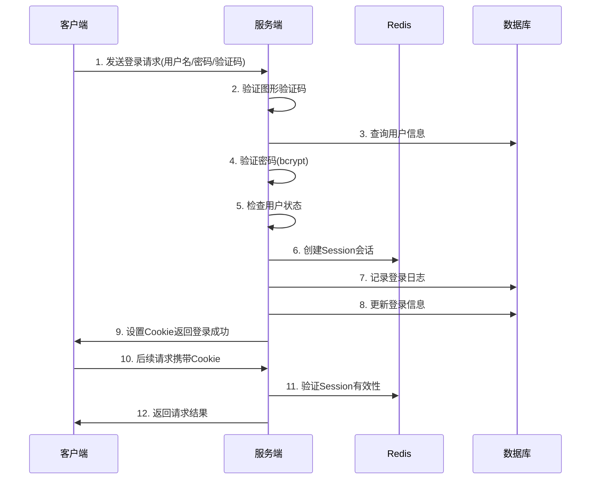

# 后台管理系统登录权限设计

## 1. 概述

本文档描述了微信小程序商城后台管理系统的登录认证和权限管理设计，采用传统的Session + Cookie认证方式，结合RBAC（基于角色的访问控制）模型实现细粒度的权限控制。

## 2. 认证方式

### 2.1 Session + Cookie 认证

采用传统的服务端会话管理方式：

- **Session存储**：使用Redis存储会话数据，支持分布式部署
- **Cookie配置**：设置HttpOnly、Secure、SameSite属性确保安全性
- **会话超时**：30分钟无操作自动过期
- **记住我功能**：可选7天免登录

### 2.2 登录流程



### 2.3 技术实现要点

#### Session配置
```javascript
// Redis Session配置
{
  store: new RedisStore({
    client: redisClient,
    prefix: 'admin_session:',
    ttl: 1800 // 30分钟
  }),
  secret: process.env.SESSION_SECRET,
  name: 'ADMIN_SESSION_ID',
  resave: false,
  saveUninitialized: false,
  cookie: {
    httpOnly: true,
    secure: process.env.NODE_ENV === 'production',
    sameSite: 'strict',
    maxAge: 30 * 60 * 1000 // 30分钟
  }
}
```

#### 密码安全
- 使用bcrypt进行密码哈希，salt轮数为10
- 支持密码强度验证
- 密码错误次数限制，超过5次锁定账户

#### 验证码机制
- 使用svg-captcha生成图形验证码
- 验证码存储在Redis中，5分钟过期
- 验证码区分大小写，4位数字+字母组合

## 3. 权限管理（RBAC）

### 3.1 RBAC模型设计

```
用户 ←→ 角色 ←→ 权限
```

#### 核心概念
- **用户（Admin）**：管理员账户
- **角色（Role）**：权限的集合，如超级管理员、商品管理员等
- **权限（Permission）**：具体的操作权限，如菜单访问、按钮操作、API接口等

### 3.2 数据库设计

#### 管理员表 (admins)
```sql
CREATE TABLE `admins` (
  `id` BIGINT PRIMARY KEY AUTO_INCREMENT,
  `username` VARCHAR(50) UNIQUE NOT NULL,
  `password` VARCHAR(255) NOT NULL,
  `real_name` VARCHAR(50),
  `email` VARCHAR(100),
  `phone` VARCHAR(20),
  `avatar` VARCHAR(255),
  `status` TINYINT DEFAULT 1,
  `last_login_time` TIMESTAMP NULL,
  `last_login_ip` VARCHAR(50),
  `login_count` INT DEFAULT 0,
  `created_at` TIMESTAMP DEFAULT CURRENT_TIMESTAMP,
  `updated_at` TIMESTAMP DEFAULT CURRENT_TIMESTAMP ON UPDATE CURRENT_TIMESTAMP
);
```

#### 角色表 (roles)
```sql
CREATE TABLE `roles` (
  `id` BIGINT PRIMARY KEY AUTO_INCREMENT,
  `name` VARCHAR(50) NOT NULL,
  `code` VARCHAR(50) UNIQUE NOT NULL,
  `description` TEXT,
  `status` TINYINT DEFAULT 1,
  `created_at` TIMESTAMP DEFAULT CURRENT_TIMESTAMP,
  `updated_at` TIMESTAMP DEFAULT CURRENT_TIMESTAMP ON UPDATE CURRENT_TIMESTAMP
);
```

#### 权限表 (permissions)
```sql
CREATE TABLE `permissions` (
  `id` BIGINT PRIMARY KEY AUTO_INCREMENT,
  `name` VARCHAR(100) NOT NULL,
  `code` VARCHAR(100) UNIQUE NOT NULL,
  `type` TINYINT NOT NULL COMMENT '1-菜单，2-按钮，3-接口',
  `parent_id` BIGINT DEFAULT 0,
  `path` VARCHAR(200),
  `component` VARCHAR(200),
  `icon` VARCHAR(50),
  `sort_order` INT DEFAULT 0,
  `status` TINYINT DEFAULT 1,
  `created_at` TIMESTAMP DEFAULT CURRENT_TIMESTAMP
);
```

#### 关联表
- **admin_roles**：管理员角色关联表
- **role_permissions**：角色权限关联表

### 3.3 权限类型

#### 菜单权限 (type=1)
控制管理员可以访问哪些菜单页面
- 系统管理、商品管理、订单管理等一级菜单
- 用户列表、角色管理等二级菜单
- 控制侧边栏菜单的显示和隐藏

#### 路由权限 (type=2)
控制页面路由的访问权限
- 防止用户通过直接输入URL访问无权限的页面
- 配合前端路由守卫实现访问控制
- 支持通配符路径匹配（如：/system/*）

#### 按钮权限 (type=3)
控制页面内的操作按钮显示和功能
- 新增、编辑、删除、查看、导出等操作按钮
- 审核、重置密码、状态切换等特殊操作按钮
- 批量操作、导入等高级功能按钮

### 3.4 权限编码规范

采用层级化的权限编码：

**菜单权限编码：**
```
模块:子模块
system:admin      # 系统管理-管理员管理
product:list      # 商品管理-商品列表
order:payment     # 订单管理-支付管理
```

**路由权限编码：**
```
route:模块:子模块
route:system      # 系统管理路由
route:product:list    # 商品列表路由
route:order:payment   # 支付管理路由
```

**按钮权限编码：**
```
btn:操作
btn:add          # 新增按钮
btn:edit         # 编辑按钮
btn:delete       # 删除按钮
btn:reset:password   # 重置密码按钮
```

## 4. 安全机制

### 4.1 登录安全

#### 账户安全
- 用户名唯一性验证
- 密码复杂度要求：8位以上，包含数字和字母
- 登录失败次数限制：5次错误后锁定30分钟
- 异地登录提醒

#### 会话安全
- Session劫持防护：定期更换SessionID
- 并发登录控制：同一账户最多3个并发会话
- 自动登出：长时间无操作自动退出
- 强制下线：管理员可强制其他用户下线

### 4.2 权限验证

#### 中间件验证
```javascript
// 认证中间件
function authMiddleware(req, res, next) {
  if (!req.session.admin) {
    return res.status(401).json({ message: '未登录' });
  }
  req.admin = req.session.admin;
  next();
}

// 权限验证中间件
function permissionMiddleware(permission) {
  return (req, res, next) => {
    if (!hasPermission(req.admin, permission)) {
      return res.status(403).json({ message: '权限不足' });
    }
    next();
  };
}
```

#### 前端权限控制
- **菜单权限**：控制侧边栏菜单的显示和隐藏
- **路由权限**：路由守卫检查页面访问权限，防止直接URL访问
- **按钮权限**：根据权限控制操作按钮的显示状态和功能

### 4.3 安全配置

#### CSRF防护
- 使用CSRF Token防止跨站请求伪造
- 表单提交时验证Token有效性

#### 安全头设置
```javascript
// 安全响应头
app.use((req, res, next) => {
  res.setHeader('X-Content-Type-Options', 'nosniff');
  res.setHeader('X-Frame-Options', 'DENY');
  res.setHeader('X-XSS-Protection', '1; mode=block');
  next();
});
```

#### 敏感操作审计
- 登录/登出记录
- 权限变更记录
- 敏感数据操作记录
- 异常操作告警

## 5. 缓存策略

### 5.1 Redis缓存设计

#### 会话缓存
```
admin_session:{session_id}  # 会话数据，30分钟过期
```

#### 权限缓存
```
admin_permissions:{admin_id}  # 管理员权限列表，1小时过期
admin_roles:{admin_id}        # 管理员角色列表，1小时过期
```

#### 验证码缓存
```
captcha:{captcha_id}  # 图形验证码，5分钟过期
```

#### 登录限制缓存
```
login_attempts:{username}  # 登录失败次数，30分钟过期
locked_account:{username}  # 账户锁定状态，30分钟过期
```

### 5.2 缓存更新策略

- 权限变更时清除相关缓存
- 角色权限修改时批量清除用户权限缓存
- 定期清理过期的会话和验证码

## 6. API接口设计

### 6.1 认证相关接口

```javascript
// 登录
POST /admin/auth/login
{
  "username": "admin",
  "password": "admin123", 
  "captcha": "abc123",
  "captchaId": "uuid",
  "remember": false
}

// 登出
POST /admin/auth/logout

// 获取验证码
GET /admin/auth/captcha
Response: {
  "captchaId": "uuid",
  "captchaImage": "data:image/svg+xml;base64,..."
}

// 获取当前用户信息
GET /admin/auth/profile
Response: {
  "id": 1,
  "username": "admin",
  "realName": "系统管理员",
  "avatar": "/images/avatar.png",
  "roles": ["super_admin"],
  "permissions": ["system:admin", "product:list", ...]
}
```

### 6.2 权限管理接口

```javascript
// 管理员管理
GET    /admin/admins           # 管理员列表
POST   /admin/admins           # 创建管理员
PUT    /admin/admins/:id       # 更新管理员
DELETE /admin/admins/:id       # 删除管理员

// 角色管理
GET    /admin/roles            # 角色列表
POST   /admin/roles            # 创建角色
PUT    /admin/roles/:id        # 更新角色
DELETE /admin/roles/:id        # 删除角色

// 权限管理
GET    /admin/permissions      # 权限树形列表
POST   /admin/permissions      # 创建权限
PUT    /admin/permissions/:id  # 更新权限
DELETE /admin/permissions/:id  # 删除权限
```

## 7. 前端集成

### 7.1 登录页面

- 用户名/密码输入框
- 图形验证码显示和刷新
- 记住我选项
- 登录状态反馈

### 7.2 权限控制

#### 路由守卫
```javascript
router.beforeEach((to, from, next) => {
  const token = getToken();
  if (token) {
    if (to.path === '/login') {
      next({ path: '/' });
    } else {
      if (store.getters.roles.length === 0) {
        store.dispatch('GetInfo').then(res => {
          const roles = res.data.roles;
          store.dispatch('GenerateRoutes', { roles }).then(() => {
            router.addRoutes(store.getters.addRouters);
            next({ ...to, replace: true });
          });
        });
      } else {
        next();
      }
    }
  } else {
    if (whiteList.indexOf(to.path) !== -1) {
      next();
    } else {
      next('/login');
    }
  }
});
```

#### 权限指令
```vue
<!-- 菜单权限控制 -->
<el-menu-item v-permission="'system:admin'">管理员管理</el-menu-item>
<el-menu-item v-permission="'product:list'">商品列表</el-menu-item>

<!-- 按钮权限控制 -->
<el-button v-permission="'btn:add'">新增</el-button>
<el-button v-permission="'btn:edit'">编辑</el-button>
<el-button v-permission="'btn:delete'">删除</el-button>
<el-button v-permission="['btn:edit', 'btn:delete']">批量操作</el-button>

<!-- 角色权限控制 -->
<div v-role="'super_admin'">超级管理员专用功能</div>

<!-- 路由权限在路由守卫中自动处理 -->
```

## 8. 部署配置

### 8.1 环境变量

```bash
# 会话配置
SESSION_SECRET=your-secret-key
SESSION_NAME=ADMIN_SESSION_ID
SESSION_TIMEOUT=1800

# Redis配置
REDIS_HOST=localhost
REDIS_PORT=6379
REDIS_PASSWORD=your-redis-password
REDIS_DB=0

# 安全配置
BCRYPT_ROUNDS=10
MAX_LOGIN_ATTEMPTS=5
ACCOUNT_LOCK_TIME=1800
```

### 8.2 Nginx配置

```nginx
# 会话粘性（如果使用多个后端服务）
upstream backend {
    ip_hash;
    server 127.0.0.1:3000;
    server 127.0.0.1:3001;
}

# 安全头设置
add_header X-Frame-Options DENY;
add_header X-Content-Type-Options nosniff;
add_header X-XSS-Protection "1; mode=block";
```

## 9. 监控告警

### 9.1 安全监控

- 异常登录监控（异地、异常时间）
- 暴力破解监控（短时间大量失败登录）
- 权限异常操作监控
- 会话异常监控

### 9.2 性能监控

- 登录响应时间监控
- Session存储性能监控
- Redis连接状态监控
- 权限查询性能监控

### 9.3 日志管理系统

#### 登录日志 (admin_login_logs)
记录管理员的登录和登出行为：
- **基本信息**：管理员ID、用户名、登录时间、登出时间
- **网络信息**：IP地址、地理位置、用户代理信息
- **设备信息**：浏览器类型、操作系统
- **结果信息**：登录状态（成功/失败）、失败原因

#### 操作日志 (admin_operation_logs)
记录管理员的所有操作行为：
- **操作信息**：操作模块、操作类型、请求方法、请求URL
- **用户信息**：操作管理员ID、用户名、IP地址
- **请求信息**：请求参数、响应结果、执行时间
- **状态信息**：操作状态、错误信息

#### 日志查询功能
- **多维度查询**：按时间、用户、模块、操作类型、IP等维度查询
- **统计分析**：登录统计、操作统计、异常统计
- **数据导出**：支持Excel、CSV格式导出
- **日志清理**：定期清理过期日志数据

#### 日志监控告警
- **异常登录监控**：异地登录、频繁失败登录
- **敏感操作监控**：删除操作、批量操作、权限变更
- **系统异常监控**：操作失败、响应超时
- **实时告警**：邮件、短信、钉钉等方式告警

## 10. 常见问题

### 10.1 Session丢失问题

**原因**：
- Redis服务重启
- Session过期
- 客户端Cookie被清除

**解决方案**：
- Redis持久化配置
- 合理设置Session超时时间
- 前端处理登录状态失效

### 10.2 权限缓存不一致

**原因**：
- 权限变更后缓存未及时更新
- 多实例部署缓存同步问题

**解决方案**：
- 权限变更时主动清除缓存
- 使用Redis发布订阅同步缓存
- 设置合理的缓存过期时间

### 10.3 并发登录问题

**原因**：
- 同一账户多处登录
- Session并发冲突

**解决方案**：
- 限制同一账户并发登录数量
- 使用分布式锁处理并发操作
- 提供强制下线功能

---

*本文档会根据系统演进持续更新和完善*